# My DevOps_Project 
## Project 1: Linux Advanced Command
## Darey.io DevOps Bootcamp

## LINUX FUNDAMENTALS

Step 1: Created an EC2 instance on a linux server
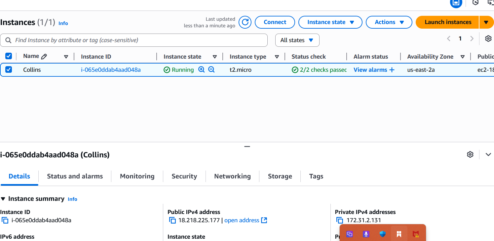

Step2: Connected an EC2 instance using SSH
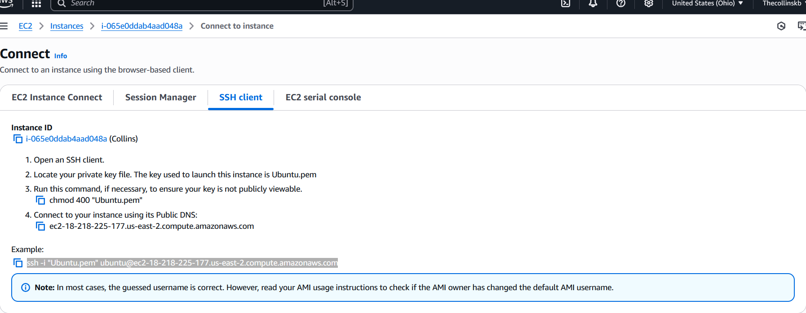

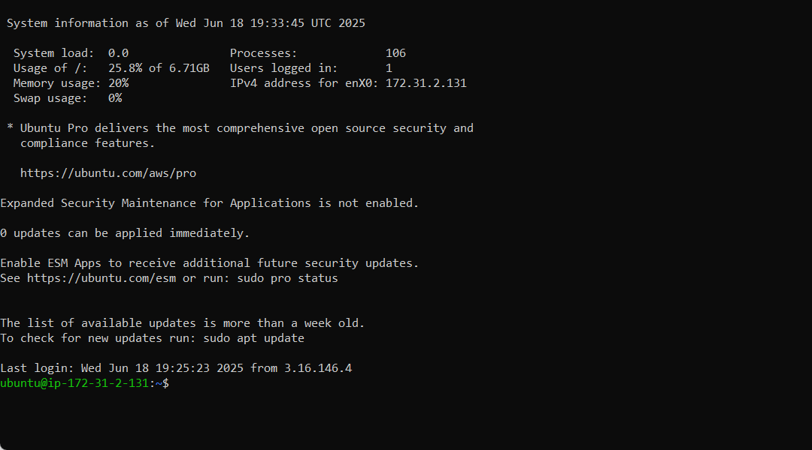

Step 3: Updated the server
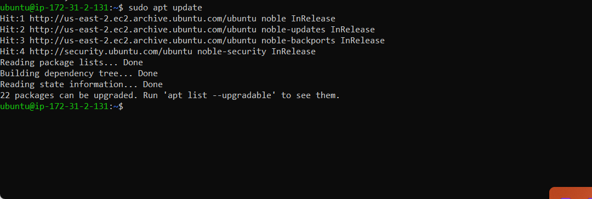

Step 4: Installed software packages
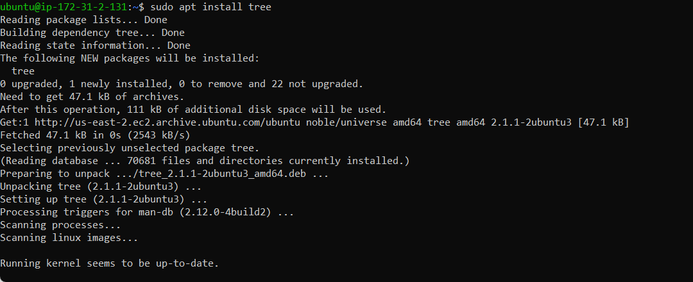

Step5: Verified Installed Packages
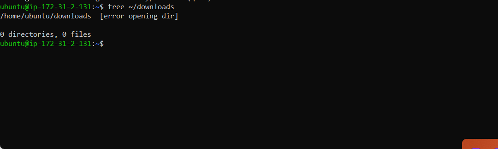

Step 6: Upgrade Installed packages

Step 7: Removed Software Package
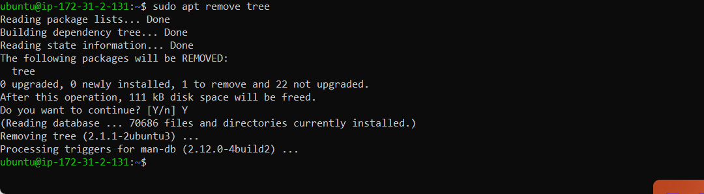

Step 8: Installed Nginx
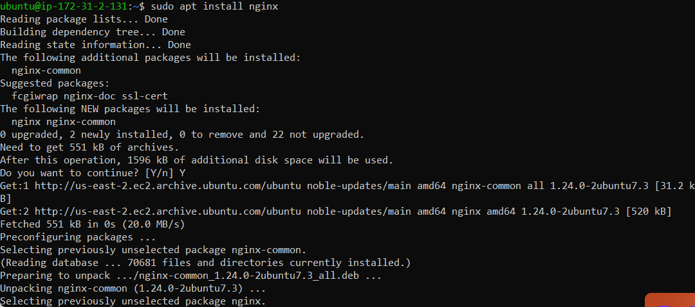

## LINUX BASIC COMMANDS

HERE ARE SOME BASIC LINUX COMMANDS AS SHOWN IN THE IMAGES BELOW

* sudo mkdir photos, ls
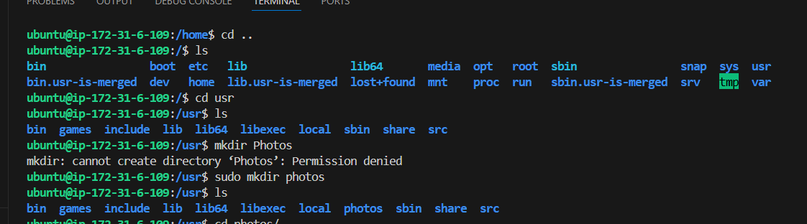

* cd photos
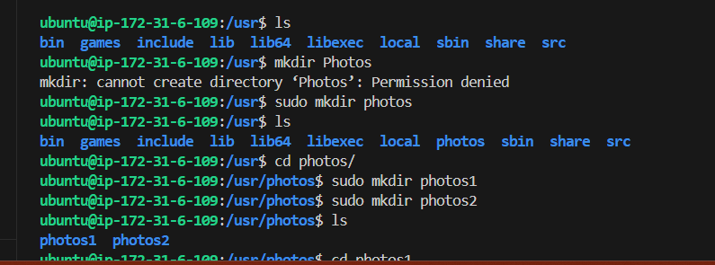

* ls -R, ls -a, ls -lh
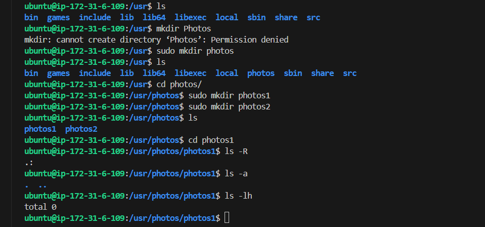

* sudo cat /etc/os-release
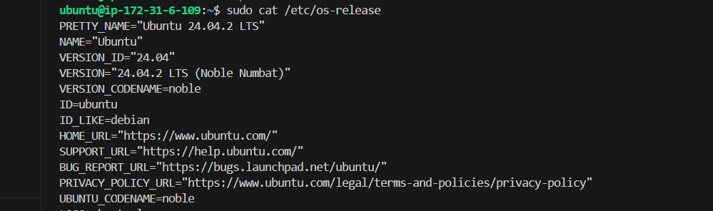

* sudo touch web.html
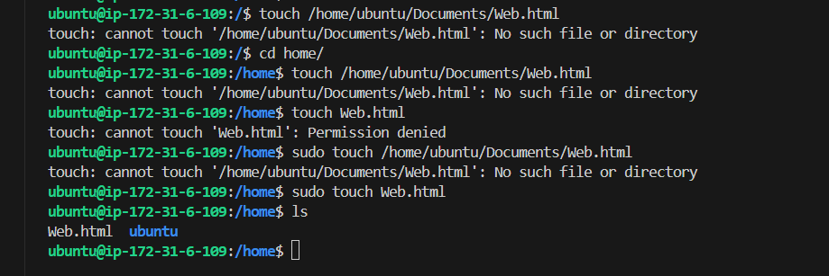

* find /home -name notes.txt
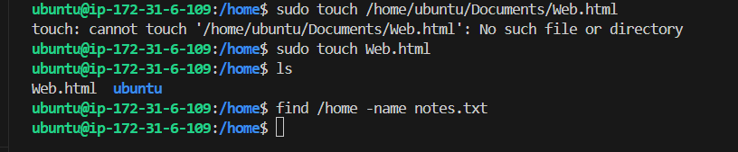

## LINUX ADVANCED COMMANDS

BELOW ARE LINUX ADVANCED COMMANDS AND ARE SHOWN IN THE SCREENSHOTS AS FOLLOWS

* sudo groupadd devops

* mkdir john, sudo adduser john, sudo usermod -aG devops john
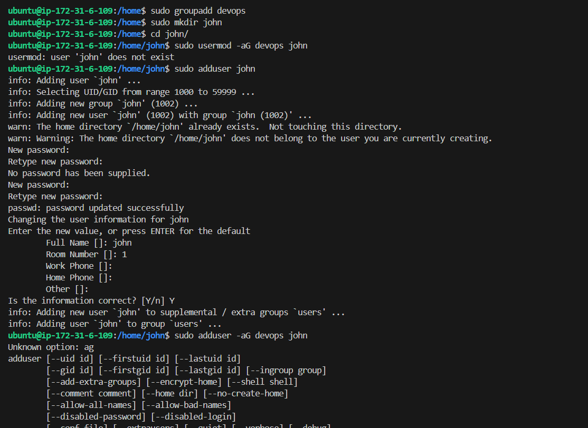

*  mkdir mary, sudo adduser mary, sudo usermod -aG devops mary
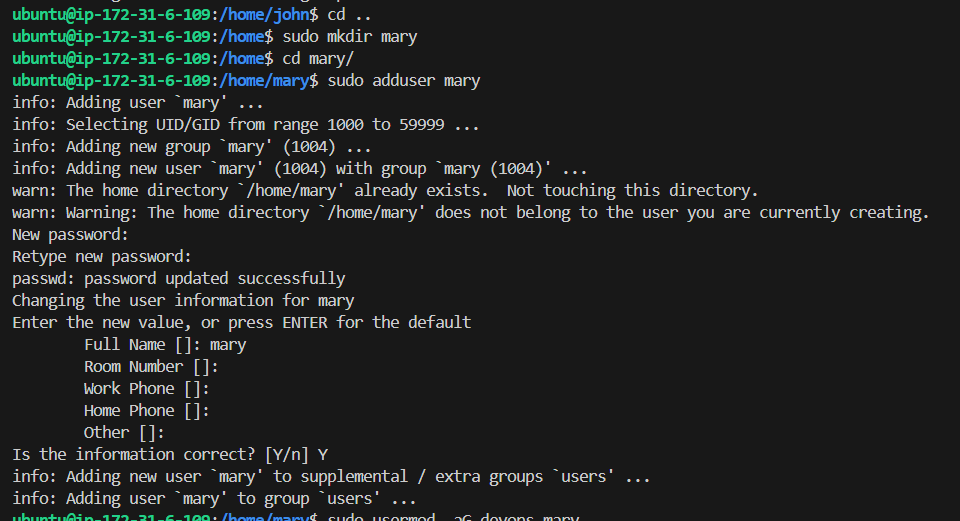

* mkdir ravi, sudo adduser ravi, sudo usermod -aG devops ravi
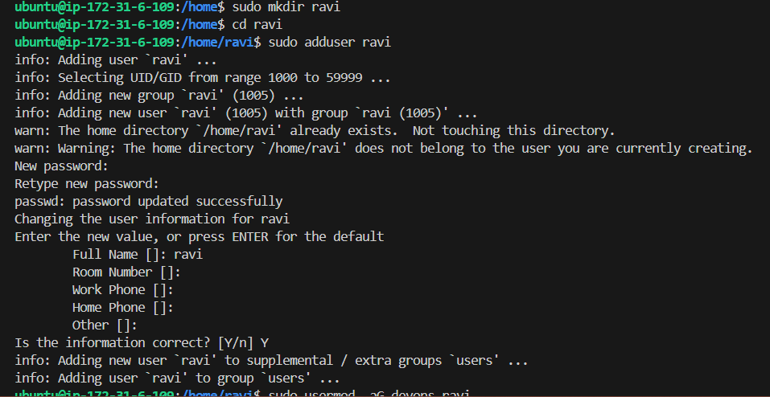

* mkdir tunji, sudo adduser tunji, sudo usermod -aG devops tunji
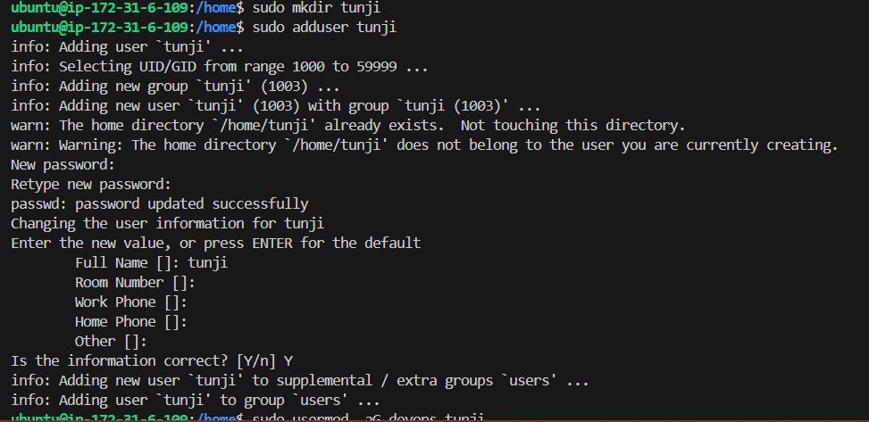

*  mkdir mohammed, sudo adduser mohammed, sudo usermod -aG devops mohammed
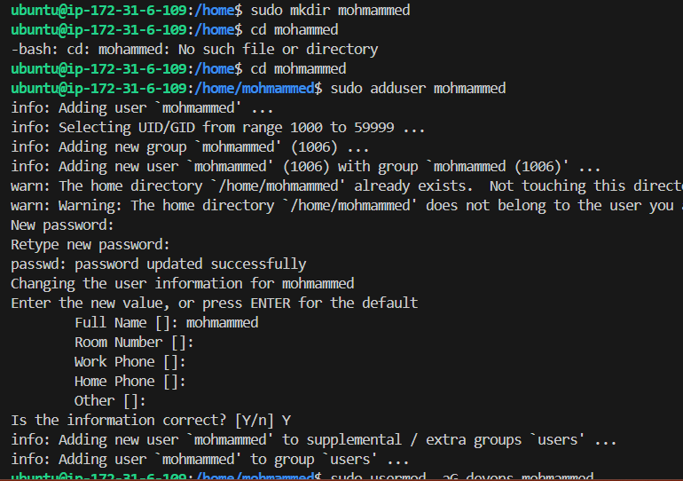

* sudo chown :devops /home/john,sudo chown :devops /home/mary,sudo chown :devops /home/ravi, sudo chown :devops /home/tunji,sudo chown :devops /home/mohammed

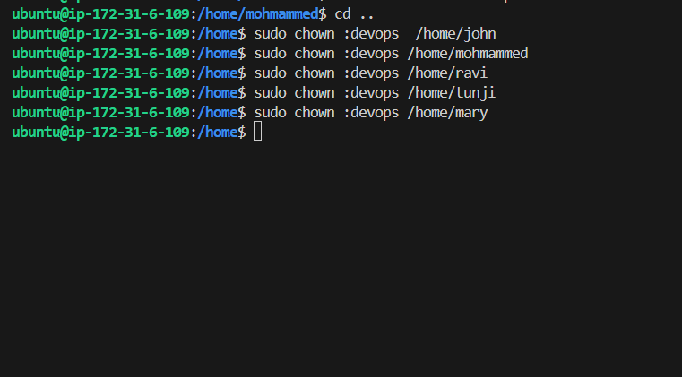

## LINUX FILE EDITOR

IN LINUX THERE ARE TWO BASIC FILE EDITORS WHICH ARE; VIM TEXT EDITOR AND NANO TEXT EDITOR.
THE FOLLOWING SHOWS HOW THE VIM AND NANO TEXT EDITORS ARE ACCESSED ON THE TERMINAL 

* sudo touch exercise.txt
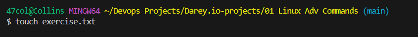

* vim exercise.txt
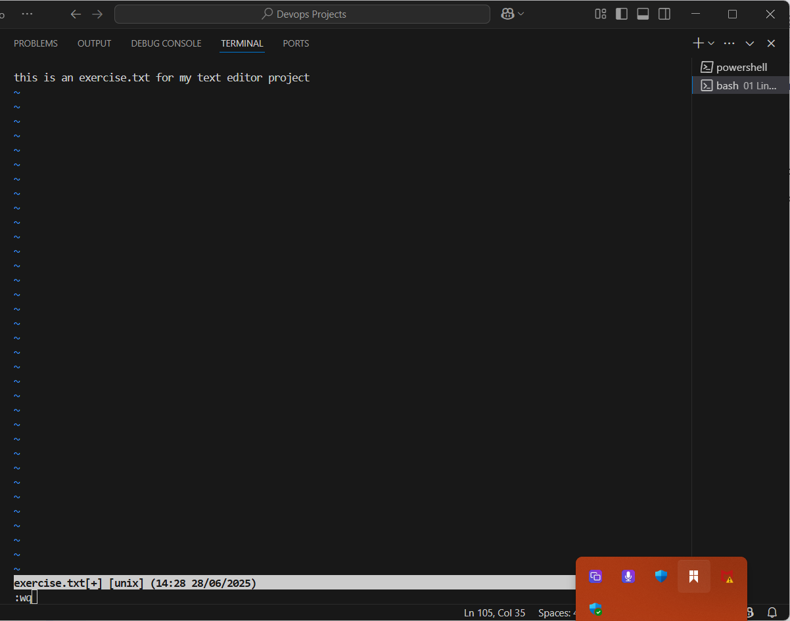

* :wq

* nano exercise.txt
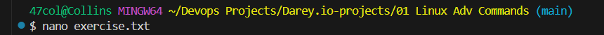

* ctrl o, Enter, ctrl x, N
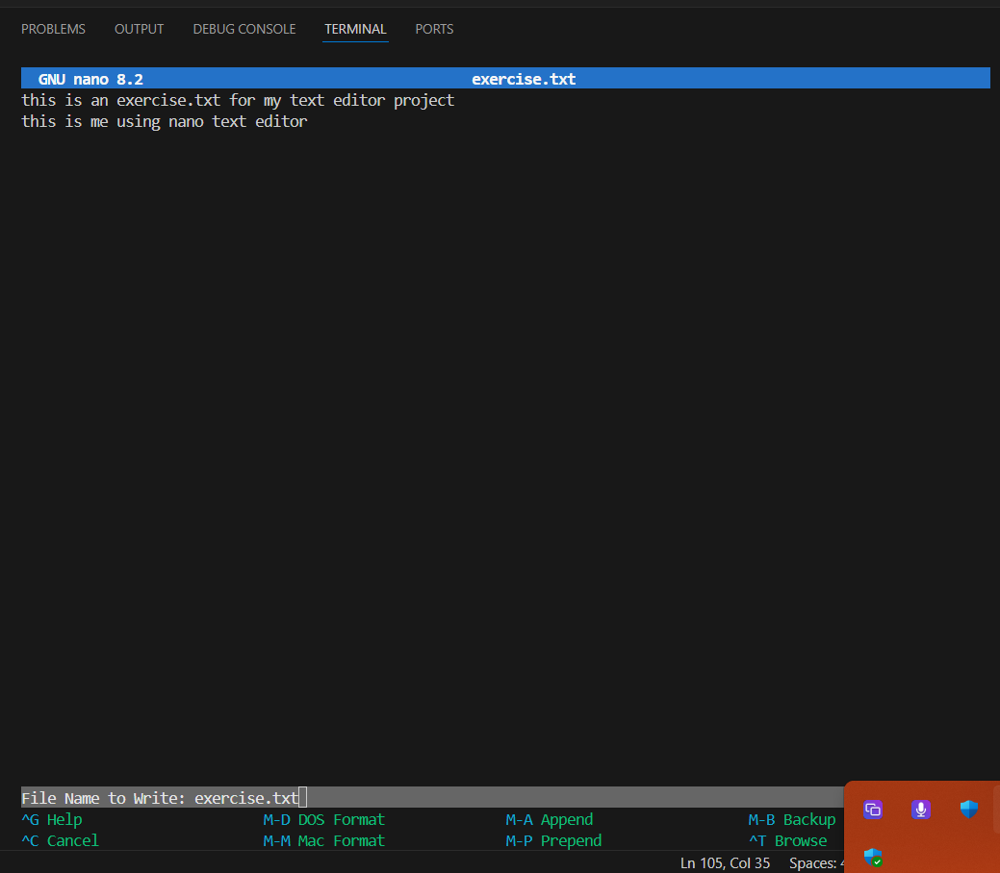

 

