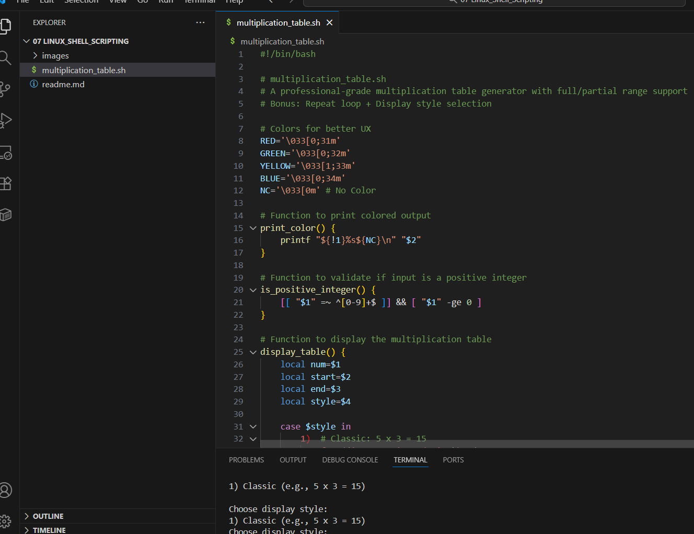
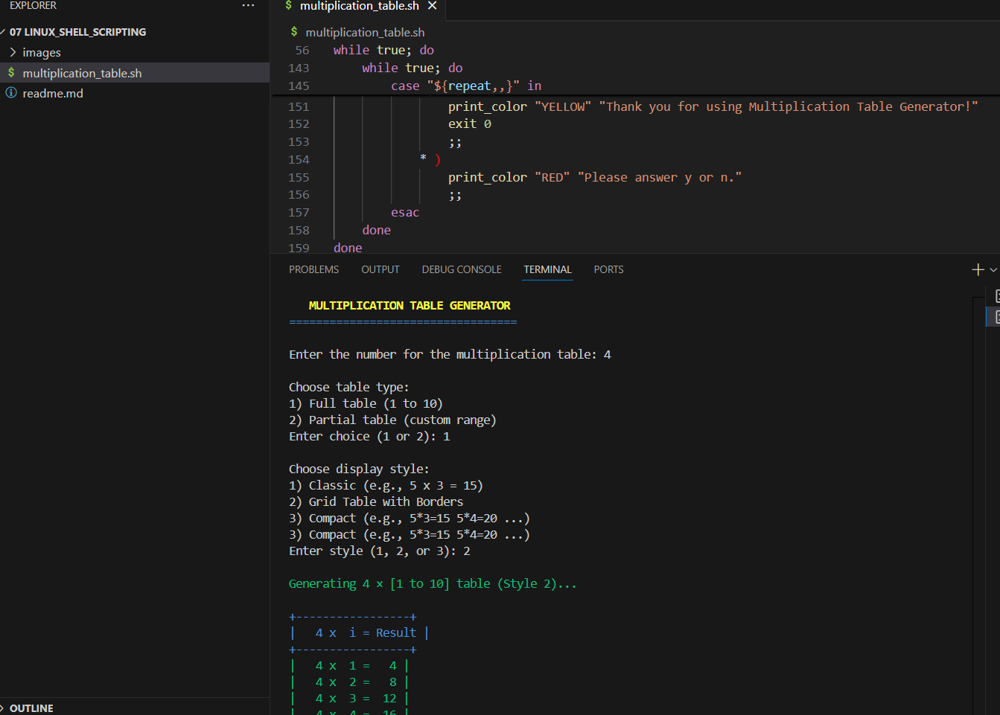
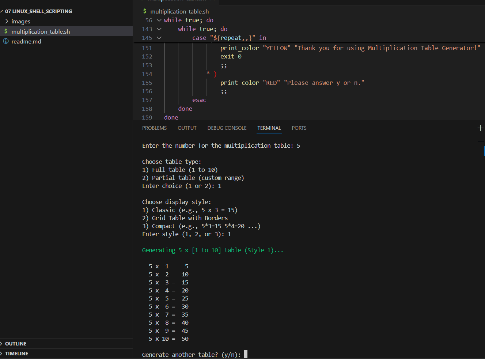
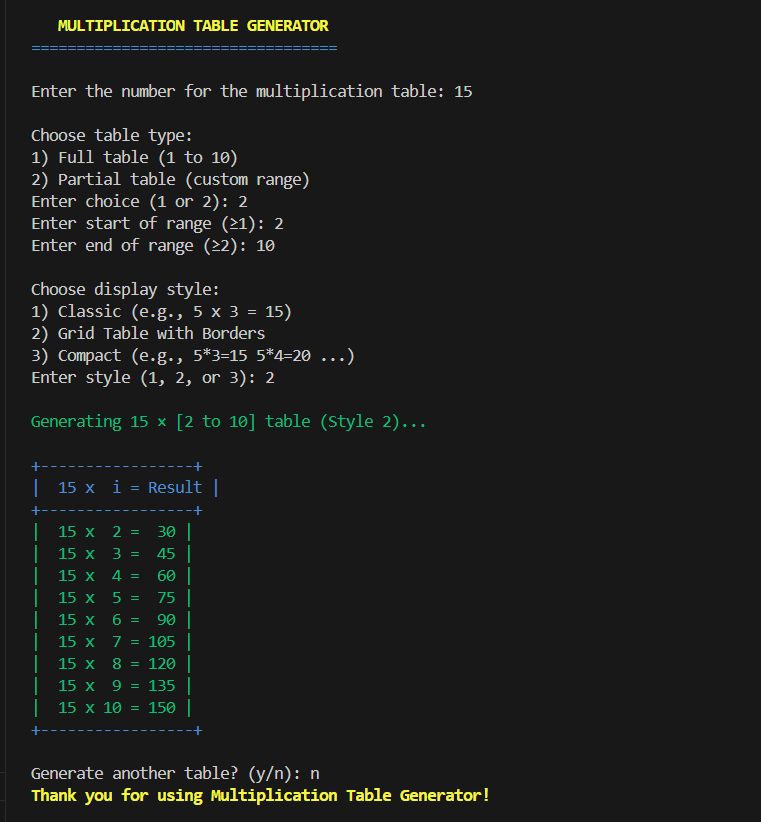
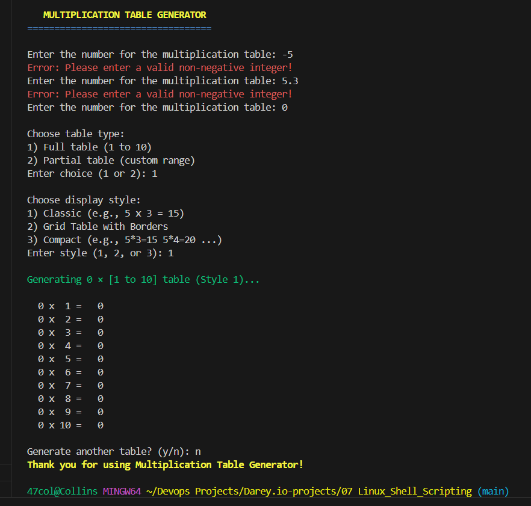

# Multiplication Table Generator  
**A Professional Bash Script for Interactive Multiplication Tables**

---

## Overview
A **user-friendly, robust, and extensible** Bash script that generates multiplication tables based on user input. It supports:
- Full tables (1–10)
- Custom range (partial tables)
- Input validation
- Multiple display styles
- Repeat functionality without restart

Perfect for **learning Bash**, **teaching math**, or **quick reference**.

---

## Features
**Interactive Input**:	Prompts for number and range
**Full / Partial Tables**:	1–10 or custom start/end
**Input Validation**:	Rejects invalid, negative, or non-numeric input
**3 Display Styles**:	Classic, Grid, Compact
**Colorized Output**:	Enhanced readability with ANSI colors
**Repeat Mode**:	Generate multiple tables in one session
**Clean Code Structure**:	Functions, loops, conditionals
---

## Screenshot
#### Multiplication Table Script

#### Multiplication Table 4

#### Multiplication Table 5

#### Multiplication Table 15

#### Invalid Input
